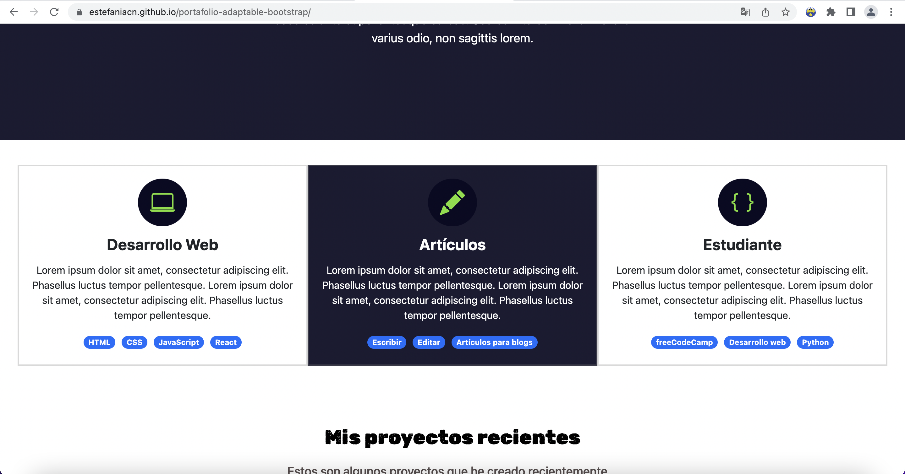
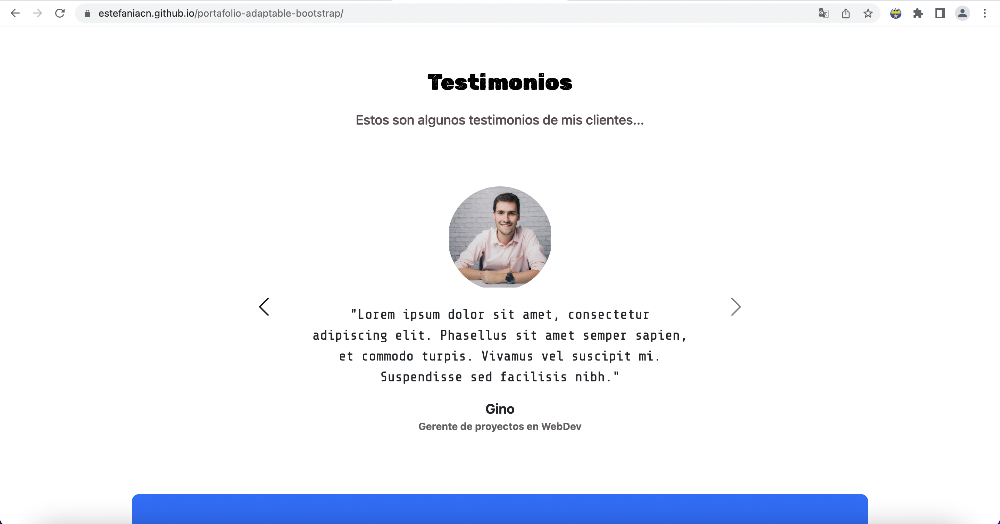
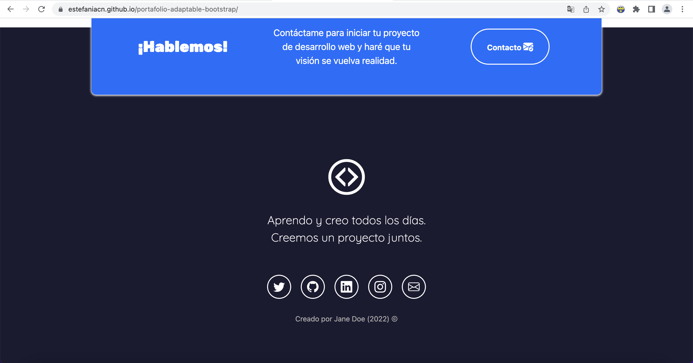

>>> Aquí puedes ver el deployment:  
https://camoralesh27.github.io/portafolioBootstrap-freeCodeCamp/

Realizar un website responsivo con el framework de bootstrap.

# Portafolio Adaptable (Responsive) con Bootstrap 5

Este proyecto creado para un curso publicado en el canal de YouTube de freeCodeCamp es una página web adaptable a dispositivos de distintos tamaños (este tipo de sitio web se conoce en inglés como "responsive"). 

El propósito de esta página web es mostrar el portafolio de proyectos de un(a) desarrollador(a) y su experiencia. Incluye una descripción breve de su motivación, experiencia, proyectos, artículos publicados y formas de contacto. 

También incluye imágenes alternativas en la carpeta `img` en caso de que se desee personalizar la imagen principal del desarrollador. 

### Capturas de pantalla:

Primera parte de la página web:

Experiencia:

Proyectos:

Testimonios:

Contacto:

## Tecnologías

Esta página web fue creada con:

* HTML
* CSS
* JavaScript 
* Bootstrap 5

Además, se incluyeron **Google Fonts** para personalizar la fuente y **Bootstrap icons** para incorporar íconos como flechas y logos de redes sociales populares. 

## Español

El texto de la página web está escrito en español, al igual que las clases y atributos personalizados. Las clases relacionadas con Bootstrap se incluyeron en inglés.

## Proyecto en vivo

Puedes acceder al proyecto original en: https://estefaniacn.github.io/portafolio-adaptable-bootstrap/

## Curso en YouTube

Para crear este proyecto paso a paso te invito a tomar el curso de forma gratuita en el canal de YouTube de [freeCodeCamp en Español](https://www.youtube.com/freecodecampespanol).

Curso de Bootstrap 5 de freeCodeCamp en Youtube: 
https://www.youtube.com/watch?v=QCw0L6FupQ0&t=773s